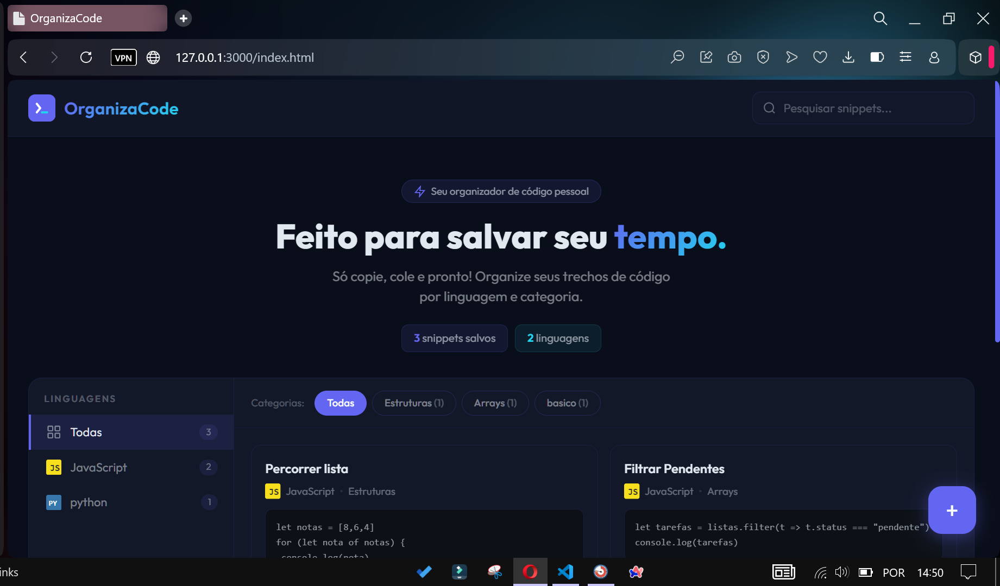

# 📦 Organizador de Códigos em JavaScript

Um projeto simples e funcional para **organizar trechos de código (snippets)** usando **JavaScript, DOM e LocalStorage**.

Ideal para desenvolvedores que querem **salvar, categorizar e encontrar códigos rapidamente**, sem perder tempo procurando em anotações soltas.

---

## ✨ Funcionalidades

- ➕ Adicionar snippets com título, linguagem, categoria e código  
- 🔍 Buscar trechos por título ou conteúdo  
- 🗑️ Remover snippets  
- 💾 Salvamento automático no **LocalStorage**  
- 🧠 Organização prática de códigos reutilizáveis  
- 🎨 Interface minimalista e limpa  

---

## 🛠️ Tecnologias utilizadas

- HTML  
- CSS  
- JavaScript  
- DOM  
- LocalStorage  

---

## 📸 Preview do projeto

<p align="center">
  
</p>

---


1. Clone o repositório:
```bash
[git clone https://github.com/seu-usuario/organizador-de-codigos](https://github.com/AmandaReiz/Organizador-de-codigo-DOM-.git)


